<p align="center">
  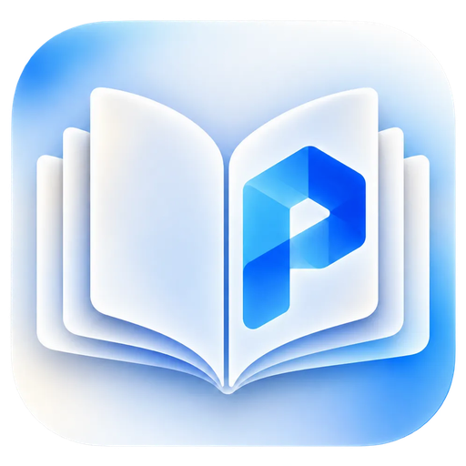
</p>

<h1 align="center">Paperazzi</h1>

<p align="center">
  <strong>The details are always worth the shot.</strong><br>
  <em>Turn forgotten blueprints, field logs, and historical archives into structured, verifiable, CAD-ready digital assets.</em>
</p>

<p align="center">
  <strong>AppCon 2026 • Team 08 (Team Cheezcribe)</strong><br>
  <em>Category: Legacy Knowledge Digitization & Asset Redefinition</em>
</p>

<p align="center">
  
  
  
</p>

<p align="center">
  <a href="https://paperazzi-appcon.vercel.app/app/"></a>
  <a href="https://paperazzi-appcon.vercel.app"></a>
  <a href="docs/PITCH_AND_JUDGING_CARD.md"></a>
</p>

<p align="center">
  
  
  
  
  
  
  
</p>

---

<p align="center">
  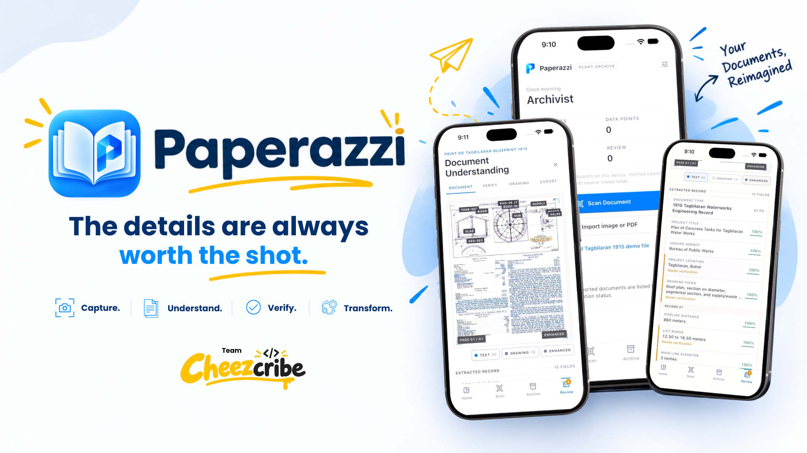
</p>

---

## ⚡ Quick Navigation

- [🏆 AppCon 2026 — Best in Pitching](#-appcon-2026--best-in-pitching)
- [💡 The Problem: Digitized ≠ Understood](#-the-problem-digitized--understood)
- [✨ What is Paperazzi?](#-what-is-paperazzi)
- [🔄 The 4-Step Intelligent Pipeline](#-the-4-step-intelligent-pipeline)
- [📐 Signature Feature 1: Blueprint to CAD Vectorization](#-signature-feature-1-blueprint-to-cad-vectorization)
- [🛡️ Signature Feature 2: Human-in-the-Loop Provenance](#️-signature-feature-2-human-in-the-loop-provenance)
- [⚡ Signature Feature 3: Hybrid On-Device & Edge AI](#-signature-feature-3-hybrid-on-device--edge-ai)
- [📱 Interactive App Walkthrough](#-interactive-app-walkthrough)
- [⚔️ Why Paperazzi? (Comparison Matrix)](#️-why-paperazzi-comparison-matrix)
- [🎯 Target Markets & Impact](#-target-markets--impact)
- [🏗️ Technical Architecture & Stack](#️-technical-architecture--stack)
- [🚀 Quick Start & Installation](#-quick-start--installation)
- [👥 Meet Team Cheezcribe](#-meet-team-cheezcribe)

---

## 🏆 AppCon 2026 — Best in Pitching

Paperazzi, created by **Team Cheezcribe (Team 08)**, won **BEST IN PITCHING** at **AppCon 2026**. We also placed **third overall out of 11 teams** with a final score of **76** and took home the **₱10,000 special-award prize**.

<p align="center">
  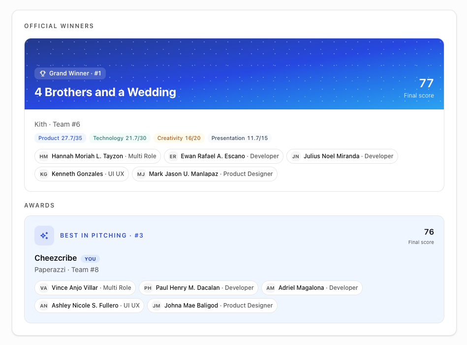
</p>

<p align="center"><em>Official winners: Paperazzi received Best in Pitching alongside the announced grand winner.</em></p>

<p align="center">
  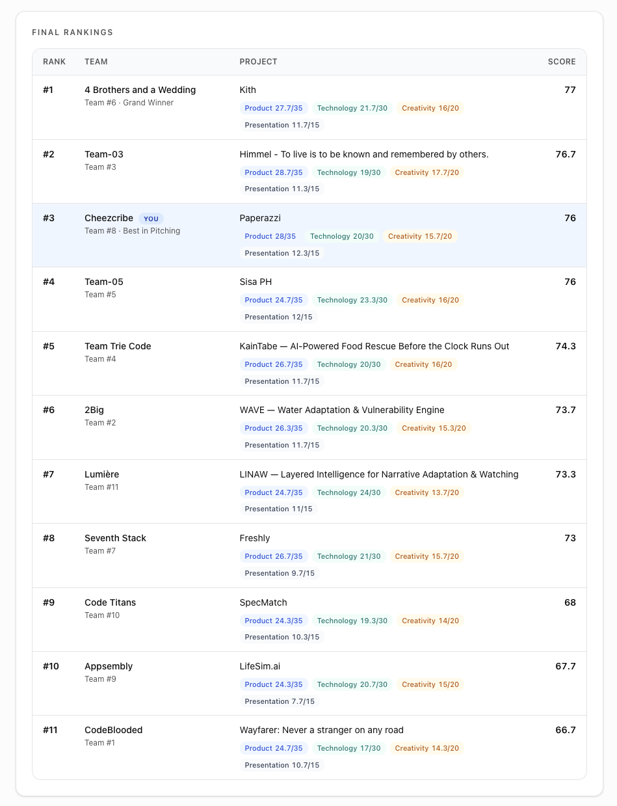
</p>

<p align="center"><em>Final standings: Team Cheezcribe ranked #3 among all 11 competing teams.</em></p>

<table align="center">
  <tr>
    <td align="center" width="50%">
      <a href="https://www.facebook.com/share/p/1MKrbLL5HP/">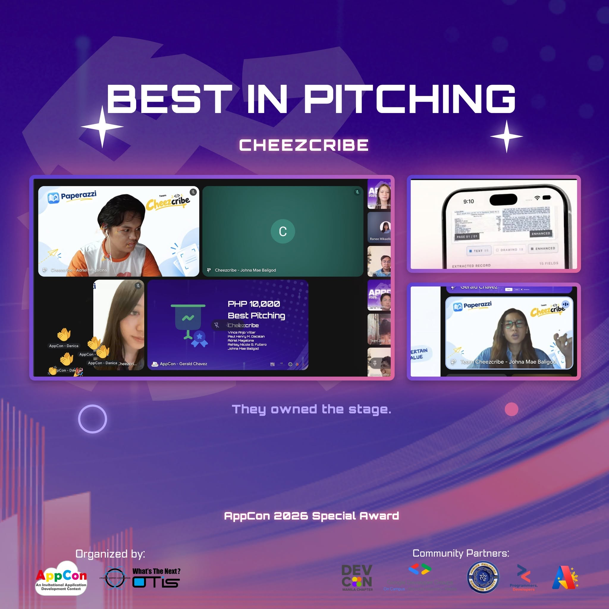</a><br>
      <b><a href="https://www.facebook.com/share/p/1MKrbLL5HP/">Official Best in Pitching announcement</a></b><br>
      <em>AppCon 2026 Special Award • ₱10,000</em>
    </td>
    <td align="center" width="50%">
      <a href="https://www.facebook.com/share/p/1C6mkbHJbp/">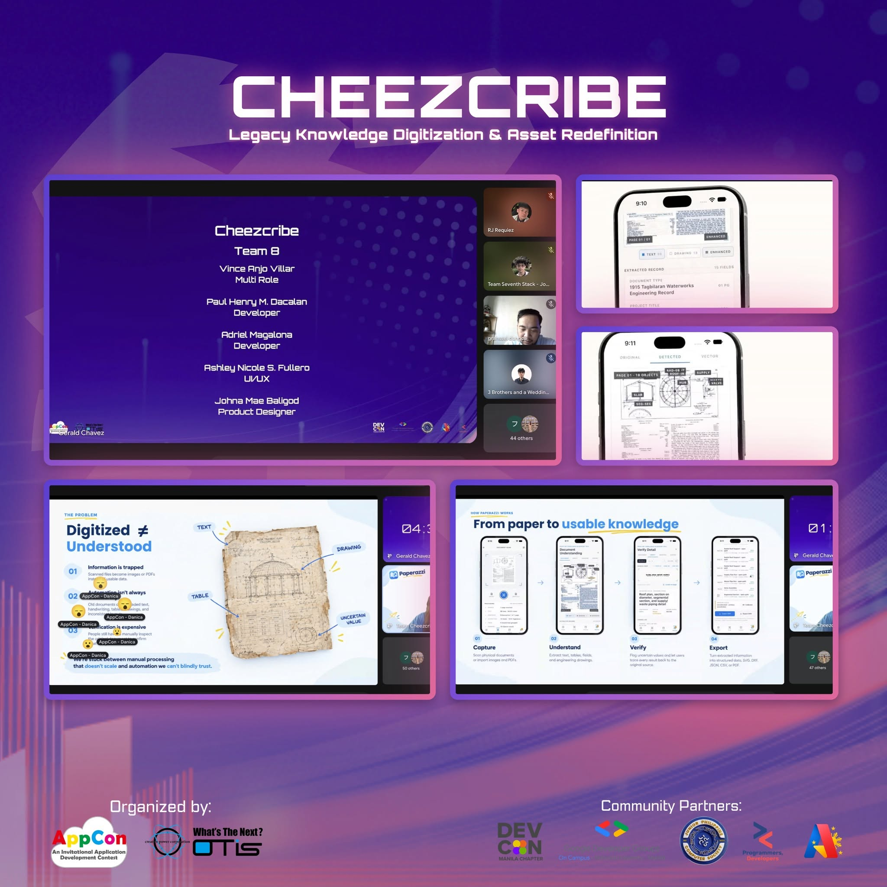</a><br>
      <b><a href="https://www.facebook.com/share/p/1C6mkbHJbp/">Team Cheezcribe pitching Paperazzi</a></b><br>
      <em>Our live AppCon 2026 presentation</em>
    </td>
  </tr>
</table>

---

## 💡 The Problem: Digitized ≠ Understood

> *"What happens when decades of critical municipal, engineering, and institutional knowledge remain trapped in fading paper?"*

Across utility departments, historical archives, public works boards, and engineering firms, billions of irreplaceable physical documents are silently decaying:
- **Hand-drafted architectural blueprints** with uncalibrated dimensions and obscured piping runs.
- **Century-old civil infrastructure plans** vital for modern maintenance and disaster resilience.
- **Municipal gazetteers, registries, and technical logs** with faded typography, stamps, and handwritten annotations.

### The Conventional Flaw

Standard scanning equipment and consumer OCR tools produce **flat, dead pixels**:
1. **Trapped Information**: A 300 DPI PDF is an image of text, not actionable database records or editable CAD geometry.
2. **CAD Blindness**: No generic scanner can distinguish between a title block, a structural column, an intake pipe, or a foundation ring.
3. **Hallucination Risk**: Modern LLMs fed noisy OCR often hallucinate missing numbers, dates, or specifications with zero traceability back to the source paper.

<p align="center">
  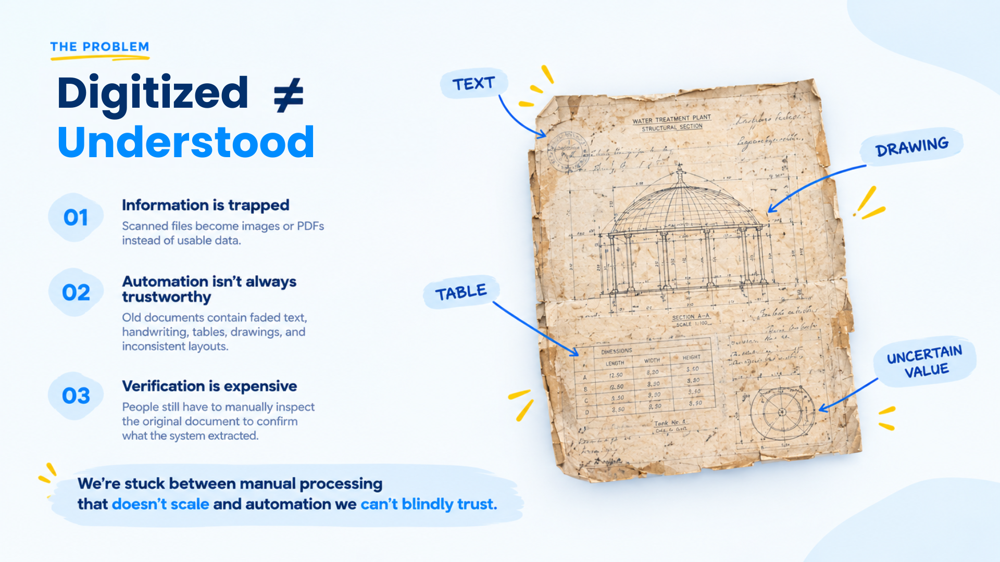
</p>

---

## ✨ What is Paperazzi?

**Paperazzi** bridges the chasm between paper history and modern engineering workflows. It is an end-to-end legacy document intelligence system built in **Flutter**, powered by **On-Device Apple Vision / ML Kit** and resilient **Edge Multimodal Vision AI**.

Unlike passive scanners, Paperazzi:
- 👁️ **Sees**: Applies adaptive local contrast enhancement and neural OCR to extract faded, low-contrast text on-device.
- 🧠 **Understands**: Segregates tabular rows, entity metadata, and engineering figures.
- 📐 **Vectorizes**: Converts architectural blueprints directly into **CAD DXF** and **SVG** geometry with interactive real-world scale calibration.
- 🔍 **Verifies**: Never presents unchecked AI guesses. Every single extracted entity is linked to its exact visual source crop with side-by-side verification and audit history.

---

## 🔄 The 4-Step Intelligent Pipeline

Paperazzi executes a disciplined four-stage pipeline designed for mission-critical accuracy:

<p align="center">
  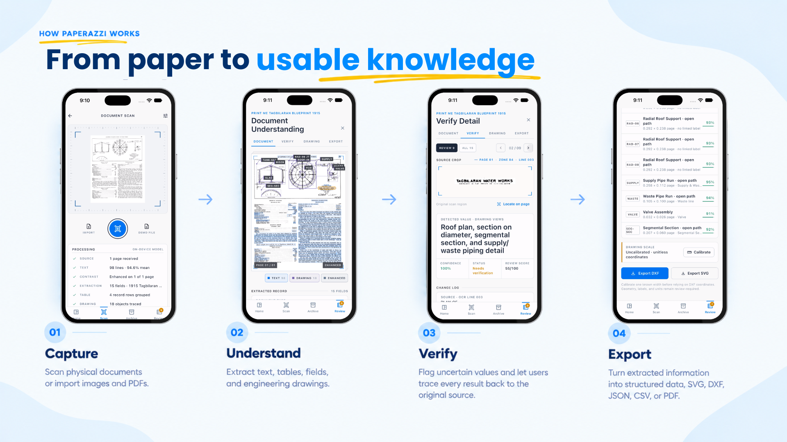
</p>

| Stage | What Happens Under the Hood | User Experience |
|:---|:---|:---|
| **01. Capture** | Invokes live device camera (`getUserMedia` on Web, `AVFoundation` on iOS, `Camera2` on Android) with multi-frame edge detection, auto-crop, perspective rectification, and contrast normalization. | Clean, glare-reduced, perspective-corrected document image retained as the immutable ground truth. |
| **02. Understand** | Runs fast on-device neural OCR (98+ lines/sec) coupled with structured entity extraction and drawing contour detection. | Instant detection of document type, project metadata, tabular entries, and geometric shapes. |
| **03. Verify** | Computes confidence scores, flags OCR/AI disagreements, and isolates exact source image bounding boxes (`PAGE • ZONE • LINE`). | Interactive **Human-in-the-Loop** verification queue. Users confirm, edit, or reject values with 1-tap review. |
| **04. Transform** | Translates structured entities into tabular records and compiles detected contours into scaled CAD vector layers. | One-tap export to **CAD DXF**, **Vector SVG**, **Field Ledger CSV**, **Records CSV**, **JSON**, and **PDF Summary**. |

---

## 📐 Signature Feature 1: Blueprint to CAD Vectorization

> *"A blueprint doesn't have to stay a picture."*

Paperazzi is the first mobile archive tool that converts physical engineering blueprints into editable CAD vectors without leaving your phone or browser.

<p align="center">
  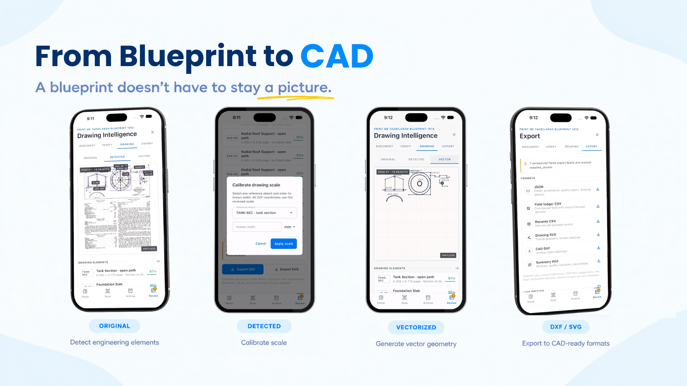
</p>

### How Drawing Intelligence Works

1. **Semantic Engineering Detection**: Distinguishes structural elements from background grid lines and annotations (e.g., *tank sections, foundation slabs, central risers, roof outer rings, radial roof supports, supply/waste pipelines, valve assemblies*).
2. **Interactive Scale Calibration**: Blueprints often have distorted reproduction ratios. Paperazzi allows the engineer to tap any detected element (e.g., a known 3-inch intake or 860-meter pipeline) and enter its real-world dimension. All vector coordinates are automatically normalized to that calibrated unit.
3. **Universal CAD Export**:
   - **AutoCAD DXF**: Ready to import into AutoCAD, SolidWorks, Revit, or FreeCAD as native vector entities.
   - **Scalable Vector Graphics (SVG)**: Crisp vector illustrations for web documentation, GIS layers, and vector renderers.

---

## 🛡️ Signature Feature 2: Human-in-the-Loop Provenance

> *"AI makes the first pass. Humans make the final call."*

Hallucinations are unacceptable in civil records, building schematics, or legal archives. Paperazzi implements an uncompromising **Zero-Hallucination Architecture**.

<p align="center">
  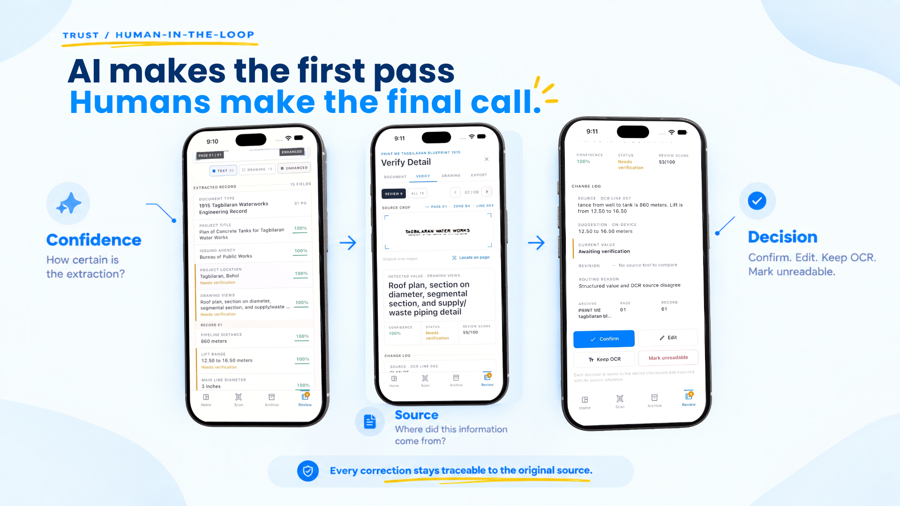
</p>

### 100% Traceable Evidence

- **Pixel-Level Provenance**: Every extracted field links directly to its parent document, page number, vertical line index, and exact image crop.
- **Disagreement Routing**: When on-device OCR and cloud AI return conflicting readings, Paperazzi never averages or conceals them. It marks the field as `Needs verification`, routes it to the top of the **Review Queue**, and displays both candidates alongside the zoomed source crop.
- **Audit Change Log**: Every decision (*Confirm*, *Edit*, *Keep OCR*, *Mark unreadable*) is logged with timestamps, reviewer decisions, and provenance data in the exported audit JSON.

<p align="center">
  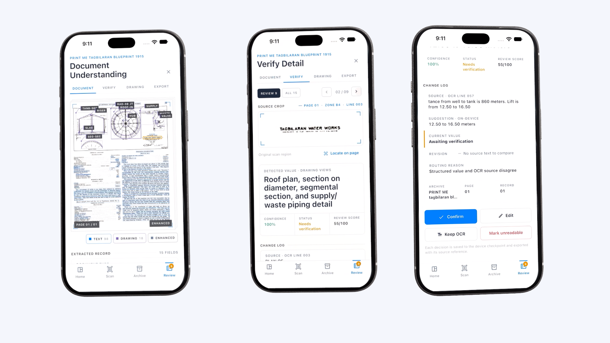
</p>

---

## ⚡ Signature Feature 3: Hybrid On-Device & Edge AI

Paperazzi delivers a privacy-first, ultra-resilient architecture combining local on-device inference with multi-tier cloud fallback:

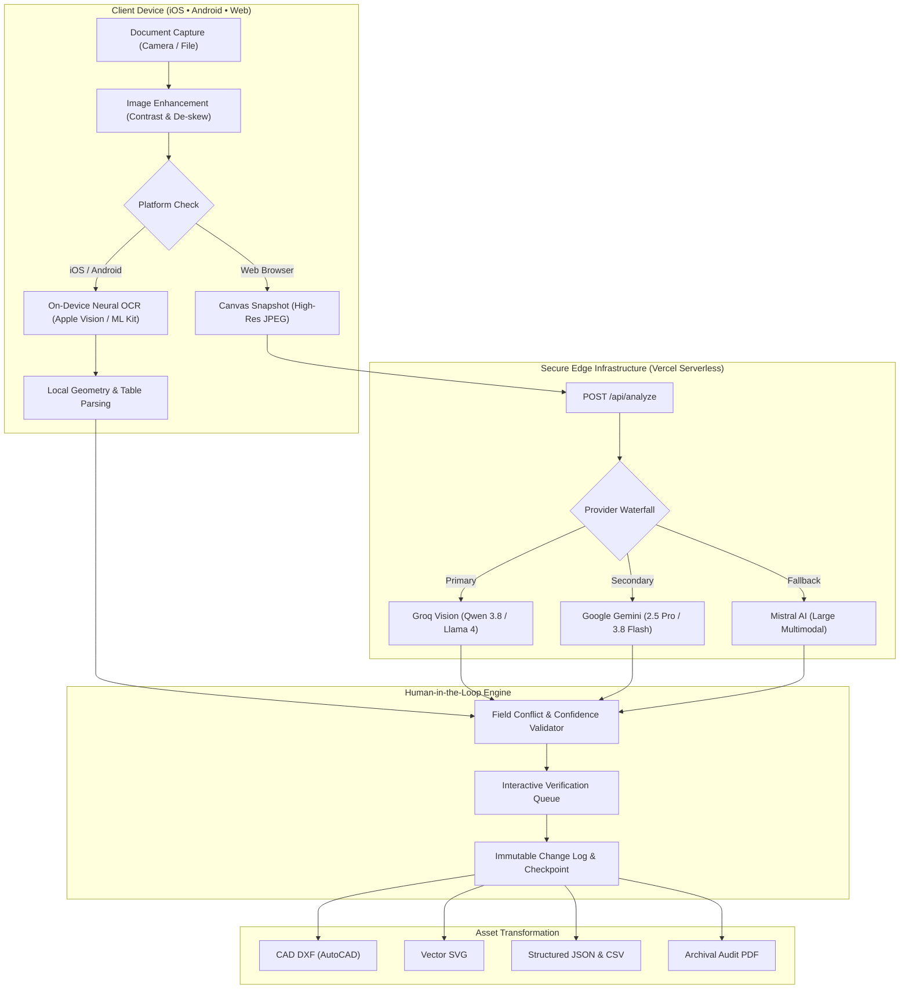
```mermaid
flowchart TD
    subgraph Client ["Client Device (iOS • Android • Web)"]
        A["Document Capture (Camera / File)"] --> B["Image Enhancement (Contrast & De-skew)"]
        B --> C{"Platform Check"}
        C -->|"iOS / Android"| D["On-Device Neural OCR (Apple Vision / ML Kit)"]
        C -->|"Web Browser"| E["Canvas Snapshot (High-Res JPEG)"]
        D --> F["Local Geometry & Table Parsing"]
    end

    subgraph Cloud ["Secure Edge Infrastructure (Vercel Serverless)"]
        E --> G["POST /api/analyze"]
        G --> H{"Provider Waterfall"}
        H -->|"Primary"| I["Groq Vision (Qwen 3.8 / Llama 4)"]
        H -->|"Secondary"| J["Google Gemini (2.5 Pro / 3.8 Flash)"]
        H -->|"Fallback"| K["Mistral AI (Large Multimodal)"]
    end

    subgraph Verification ["Human-in-the-Loop Engine"]
        F --> L["Field Conflict & Confidence Validator"]
        I --> L
        J --> L
        K --> L
        L --> M["Interactive Verification Queue"]
        M --> N["Immutable Change Log & Checkpoint"]
    end

    subgraph Output ["Asset Transformation"]
        N --> O["CAD DXF (AutoCAD)"]
        N --> P["Vector SVG"]
        N --> Q["Structured JSON & CSV"]
        N --> R["Archival Audit PDF"]
    end
```

### Why This Hybrid Architecture Wins

1. **Zero Data Leakage for Classified Documents**: On native iOS and Android, all OCR, table parsing, drawing vectorization, and checkpoint storage can run **100% offline on-device**. No cloud key required.
2. **Instant Web Availability for Public Visitors**: The web app runs without downloading gigabytes of models. It delegates image understanding to a secure edge proxy with a **75-second timeout** and multi-provider redundancy.
3. **Resilient Provider Cascade**: If Groq rate-limits or cold-starts, Gemini immediately picks up the payload. If Gemini fails, Mistral engages. The user never sees a broken screen.

---

## 📱 Interactive App Walkthrough

Experience Paperazzi through its production interface:

<p align="center">
  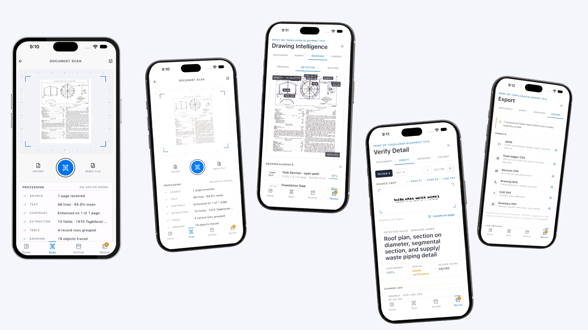
</p>

### Screen Breakdown

<table align="center">
  <tr>
    <td align="center" width="33%">
      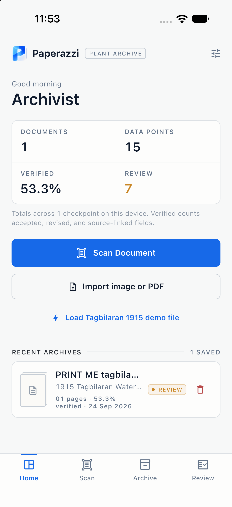<br>
      <b>01. Plant Archive</b><br>
      <em>Track checkpoints, verified counts, and scan documents with 1 tap.</em>
    </td>
    <td align="center" width="33%">
      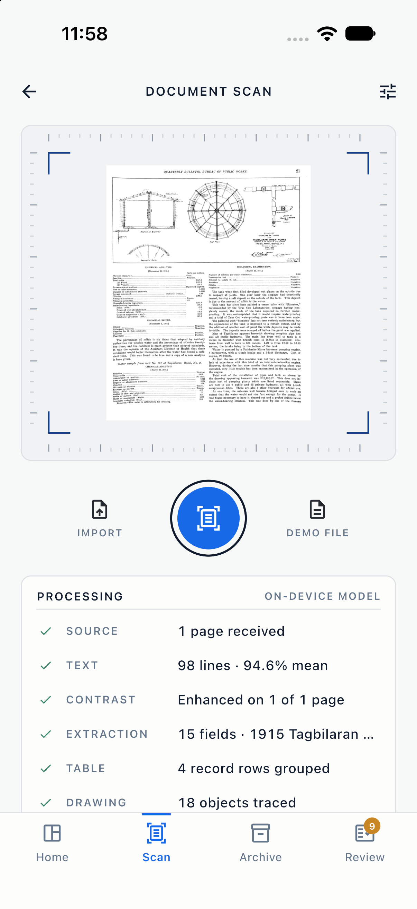<br>
      <b>02. Live Diagnostics</b><br>
      <em>Real-time telemetry of OCR confidence, contrast passes, and geometry.</em>
    </td>
    <td align="center" width="33%">
      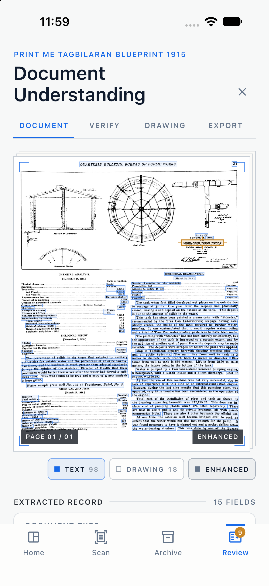<br>
      <b>03. Understanding</b><br>
      <em>Structured entities, classified document types, and field ledgers.</em>
    </td>
  </tr>
  <tr>
    <td align="center" width="33%">
      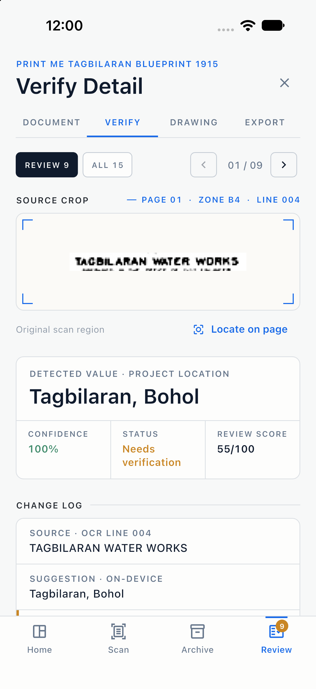<br>
      <b>04. Verification Queue</b><br>
      <em>Zoomed source crop, change logs, and 1-tap human decisions.</em>
    </td>
    <td align="center" width="33%">
      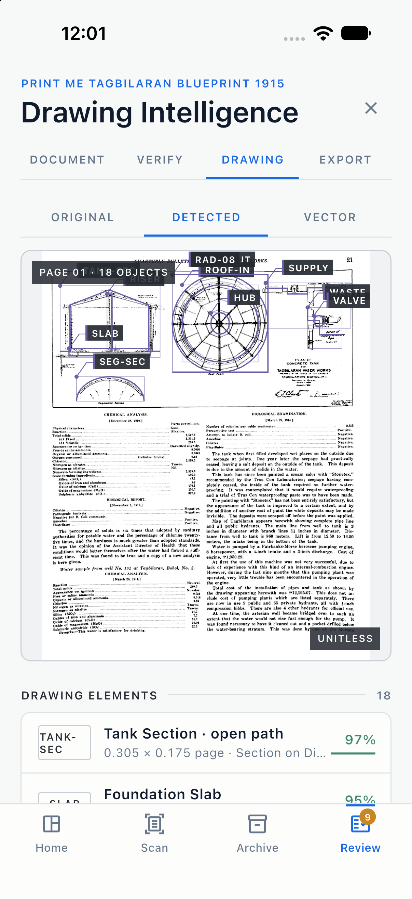<br>
      <b>05. Drawing Intelligence</b><br>
      <em>Traced engineering objects, callout tags, and scale calibration.</em>
    </td>
    <td align="center" width="33%">
      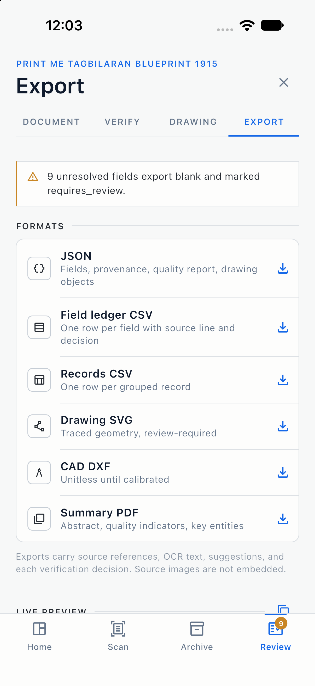<br>
      <b>06. Multi-Format Export</b><br>
      <em>Export to CAD DXF, SVG, CSV, JSON, and summary PDF.</em>
    </td>
  </tr>
</table>

---

## ⚔️ Why Paperazzi? (Comparison Matrix)

<p align="center">
  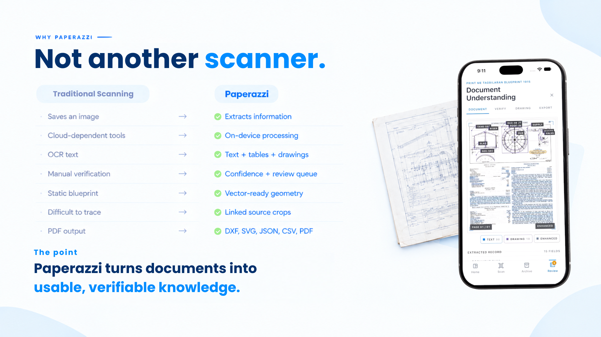
</p>

| Capability | Traditional Mobile Scanners | Generic Cloud OCR (AWS/Google) | Paperazzi |
|:---|:---:|:---:|:---:|
| **Output Format** | Flat PDF / JPG | Unstructured Plain Text | **CAD DXF, Vector SVG, JSON, CSV, PDF** |
| **Engineering Blueprint Parsing** | ❌ Treated as plain picture | ❌ Ignores vectors and pipes | ✅ **Traces semantic CAD elements** |
| **Scale & Dimension Calibration** | ❌ None | ❌ None | ✅ **Interactive real-world scaling** |
| **Human-in-the-Loop UI** | ❌ Manual retyping | ❌ Developer API only | ✅ **Built-in visual review queue** |
| **Source Provenance Citation** | ❌ Lost | ❌ Approximate word bounding boxes | ✅ **Exact page, zone, and line crop linking** |
| **Offline Privacy Mode** | ⚠️ Partial | ❌ Cloud-dependent | ✅ **100% on-device native OCR** |
| **Degraded / Faded Paper Support** | ❌ Unreadable OCR | ⚠️ Noisy character errors | ✅ **Local contrast enhancement pass** |

---

## 🎯 Target Markets & Impact

<p align="center">
  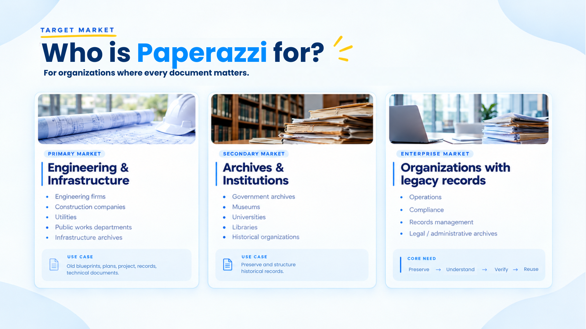
</p>

1. **Engineering, Utilities & Public Works**:
   - Municipal waterworks, electrical grids, transport authorities, and construction firms managing decades of physical blueprints.
   - *Use Case*: Convert 1950s water pipeline drawings into modern AutoCAD layers for immediate GIS mapping.
2. **National Archives, Libraries & Cultural Institutions**:
   - Government records offices, universities, museums, and historical registries.
   - *Use Case*: Structure century-old municipal gazetteers into searchable demographic databases without losing original scan provenance.
3. **Enterprise Compliance & Legal Records**:
   - Industrial plants, maritime fleets, and corporate legal archives with strict audit trail requirements.
   - *Use Case*: Digitize equipment maintenance logs with verifiable change logs for ISO compliance.

---

## 🏗️ Technical Architecture & Stack

### Frontend & Core Application
- **Framework**: [Flutter 3.x](https://flutter.dev) (Dart 3.x) targeting **iOS**, **Android**, and **Web**.
- **Native iOS Engine**: Swift / Objective-C bridging with `Apple Vision` (`VNRecognizeTextRequest`, `VNDetectRectanglesRequest`) and `CoreGraphics`.
- **Native Android Engine**: Kotlin with Google `ML Kit Text Recognition` and `Camera2`.
- **Web Engine**: Flutter Web compiled to optimized CanvasKit JS with direct `html.window.navigator.mediaDevices.getUserMedia` hardware integration.

### Edge Backend & Vision Proxy
- **Runtime**: Node.js 24 Serverless Functions deployed on [Vercel](https://vercel.com).
- **Vision AI Inference**:
  - **Groq Cloud**: Ultra-low-latency `qwen/qwen3.8-27b` and `meta-llama/llama-4-scout-17b-16e-instruct`.
  - **Google Gemini**: Multimodal `gemini-2.5-pro` and `gemini-3.8-flash`.
  - **Mistral AI**: Fallback `mistral-large-latest`.
- **Web Landing Page**: [Vite](https://vitejs.dev) + [React 19](https://react.dev) with responsive interactive device showcase and dynamic preview modals.

### Repository Layout

```
.
├── api/
│   └── analyze.mjs             # Resilient edge AI proxy (Groq → Gemini → Mistral)
├── app/
│   ├── lib/
│   │   ├── legacy/             # Document pipeline, verification, CAD export, models
│   │   ├── services/           # AI Service, Cloud Proxy, Firebase bindings
│   │   └── main.dart           # App entry point & platform routing
│   ├── ios/                    # Native iOS runner & Vision framework bridges
│   ├── android/                # Native Android runner & ML Kit bridges
│   └── test/                   # Automated unit, widget, and validation test suite
├── landing/                    # Vite + React landing page & web app shell
├── readme_images/              # Pitch deck slides, screen mockups, and icons
├── docs/                       # Architecture specs, validation logs, judging cards
└── output/                     # Production export samples and test artifacts
```

---

## 🚀 Quick Start & Installation

### Option 1: Try Instantly in Your Browser (No Installation)

Open **[https://paperazzi-appcon.vercel.app/app/](https://paperazzi-appcon.vercel.app/app/)** on any phone, tablet, or desktop browser:
1. Tap **Scan Document** to open your live camera and capture any physical sheet.
2. Or tap **Load Tagbilaran 1915 demo file** to explore the pre-loaded municipal waterworks blueprint demo.
3. Review extracted entities, calibrate drawing scale, and export CAD files directly!

---

### Option 2: Run Locally (Flutter iOS / Android / Web)

#### Prerequisites
- [Flutter SDK 3.29+](https://docs.flutter.dev/get-started/install)
- Xcode 15+ (for iOS Simulator or physical iPhone)
- Android Studio / SDK (for Android emulator or physical device)
- Node.js 20+ (for edge proxy and landing page)

```bash
# 1. Clone the repository
git clone https://github.com/adr1el-m/cheezcribe.git
cd cheezcribe

# 2. Run automated test suite
cd app
flutter test test/legacy_validation_test.dart test/widget_test.dart

# 3. Launch on iOS Simulator
flutter run -d iPhone

# 4. Or launch in Chrome for Web
flutter run -d chrome
```

#### Running the Vercel Edge API Locally

```bash
# In project root
vercel dev
```

---

## 🧪 Rigorous Verification & Testing

Every core capability in Paperazzi is covered by automated unit and integration tests:

```bash
$ flutter test test/legacy_validation_test.dart test/widget_test.dart
00:01 +19: All tests passed!
```

Key validated boundaries:
- ✅ **Agreement is never falsely called verified**: Fields require explicit human confirmation.
- ✅ **OCR conflict isolation**: Conflicting readings are deterministically routed to the review queue.
- ✅ **Semantic CAD Profile**: Detects minimum 15 distinct engineering objects with vertices and labels.
- ✅ **Tabular Gazetteer Structuring**: Successfully groups multi-column census data into structured rows.
- ✅ **Independent Checkpoint Storage**: Session persistence survives app termination and cache eviction.

---

## 👥 Meet Team Cheezcribe

<p align="center">
  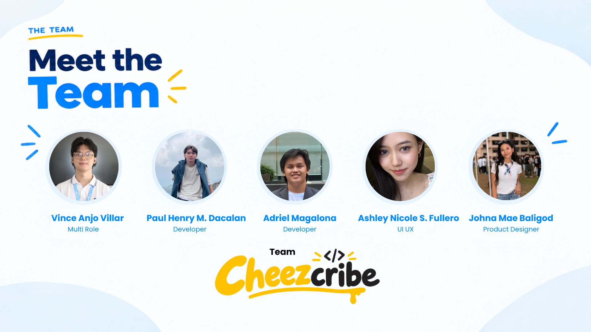
</p>

<table align="center">
  <tr>
    <th align="center">Member</th>
    <th align="center">Role</th>
    <th align="center">Core Focus</th>
  </tr>
  <tr>
    <td><b>Vince Anjo Villar</b></td>
    <td>Multi-Role & Strategy</td>
    <td>Concept formulation, product strategy, pitch presentation, and competition alignment.</td>
  </tr>
  <tr>
    <td><b>Paul Henry M. Dacalan</b></td>
    <td>Developer</td>
    <td>Vercel edge proxy, web landing architecture, cloud fallback routing, and responsive web shell.</td>
  </tr>
  <tr>
    <td><b>Adriel Magalona</b></td>
    <td>Developer</td>
    <td>Flutter core pipeline, iOS Apple Vision integration, drawing vectorizer, and test suite.</td>
  </tr>
  <tr>
    <td><b>Ashley Nicole S. Fullero</b></td>
    <td>UI/UX Designer</td>
    <td>Design system, high-contrast industrial UI, verification queue UX, and slide design.</td>
  </tr>
  <tr>
    <td><b>Johna Mae Boligod</b></td>
    <td>Product Designer</td>
    <td>User journeys, physical-to-digital workflows, drawing intelligence specs, and asset design.</td>
  </tr>
</table>

---

## 📄 License & Intellectual Property

This project is licensed under the **MIT License** — see the [LICENSE](LICENSE) file for details.

Developed with pride by **Team Cheezcribe (Team 08)** for **AppCon 2026**.

<p align="center">
  <sub>Built for archivists, civil engineers, and everyone who believes history is worth keeping usable.</sub>
</p>
