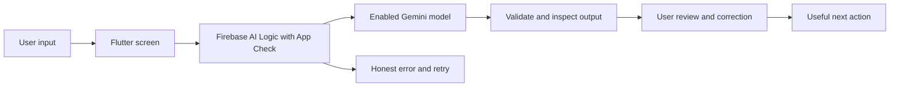

# Architecture blueprint

Preparation lab uses Firebase AI Logic directly from Android. The final entry architecture must reflect the theme and actual data requirements; this blueprint is a recommendation.



## Final entry boundaries

Keep presentation, inference and validation separate. Screens gather input and display state. An AI service owns requests and deadlines. Domain types own parsed fields and validation. Source records retain provenance. Tests check behavior rather than prompt wording.

```text
lib/
  main.dart                  # initialization only
  app.dart                   # theme/navigation
  features/core_task/
    input_screen.dart
    review_screen.dart
    result_screen.dart
  services/ai_service.dart   # model requests, errors, deadline
  domain/task_result.dart    # structure and validation
  data/reference_source.dart # if source grounding is necessary
test/
  task_result_test.dart
  workflow_test.dart
```

The lab deliberately remains a small wiring exercise. Split the actual entry when the central task is known.

## Data and trust

App Check is app attestation, not user authentication and not a strict per-user usage limit. Domain decisions, privileged operations, external service secrets and enforceable quotas belong on a server if the entry needs them. Avoid adding that server until the requirement is clear.

Do not commit personal input or App Check debug tokens. Keep sample inputs synthetic or explicitly consented. If personal documents become necessary, describe transmission and retention to the user before upload. Claim only the handling actually implemented.

For source-backed results, preserve a stable source ID, title, version/date and exact relevant excerpt. Validate that generated source IDs exist and that cited excerpts match stored text. That verifies citation integrity; evaluating whether a claim is actually supported still needs task-specific checks.

## Offline and failure behavior

No network means no new cloud inference. Preserve editable input and explain retry. Do not claim offline AI because a sample or prior answer is displayed. If local persistence becomes necessary, make retention/deletion explicit and test it. The current lab keeps input only in memory.

`Future.timeout` stops waiting locally; it does not cancel provider computation or guarantee no charge. Avoid automatic retries. Make retry user initiated and preserve the input.
